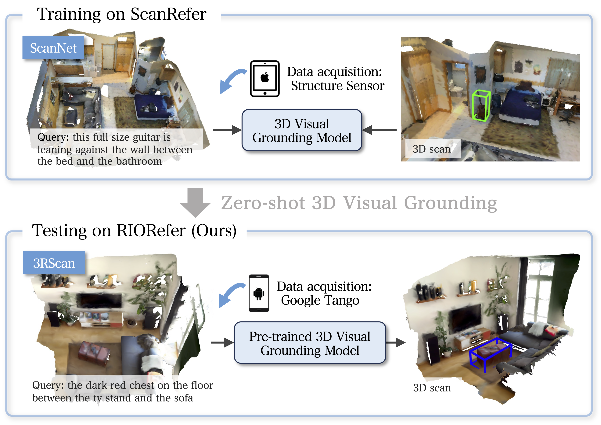

# Cross3DVG: Cross-Dataset 3D Visual Grounding on Different RGB-D Scans

<p align="center"></p>

This is the official repository of our paper [**Cross3DVG: Cross-Dataset 3D Visual Grounding on Different RGB-D Scans** (3DV 2024)](https://arxiv.org/abs/2305.13876) by Taiki Miyanishi, Daichi Azuma, Shuhei Kurita, and Motoaki Kawanabe.

## Abstract
We present a novel task for cross-dataset visual grounding in 3D scenes (Cross3DVG), which overcomes limitations of existing 3D visual grounding models, specifically their restricted 3D resources and consequent tendencies of overfitting a specific 3D dataset. We created RIORefer, a large-scale 3D visual grounding dataset, to facilitate Cross3DVG. It includes more than 63k diverse descriptions of 3D objects within 1,380 indoor RGB-D scans from 3RScan, with human annotations. After training the Cross3DVG model using the source 3D visual grounding dataset, we evaluate it without target labels using the target dataset with, e.g., different sensors, 3D reconstruction methods, and language annotators. Comprehensive experiments are conducted using established visual grounding models and with CLIP-based multi-view 2D and 3D integration designed to bridge gaps among 3D datasets. For Cross3DVG tasks, (i) cross-dataset 3D visual grounding exhibits significantly worse performance than learning and evaluation with a single dataset because of the 3D data and language variants across datasets. Moreover, (ii) better object detector and localization modules and fusing 3D data and multi-view CLIP-based image features can alleviate this lower performance. Our Cross3DVG task can provide a benchmark for developing robust 3D visual grounding models to handle diverse 3D scenes while leveraging deep language understanding.

## Installation
<!-- Please refer to [installation guide](docs/INSTALL.md). -->
```shell
# create and activate the conda environment
conda create -n cross3dvg python=3.10
conda activate cross3dvg

# install PyTorch
pip install torch==1.13.1+cu116 torchvision==0.14.1+cu116 torchaudio==0.13.1 --extra-index-url https://download.pytorch.org/whl/cu116

# istall the necessary packages with `requirements.txt`:
pip install -r requirements.txt

# install the PointNet++:
cd lib/pointnet2
python setup.py install
```

### Installation
This code has been tested with Python 3.10, pytorch 1.13.1, and CUDA 11.6 on Ubuntu 20.04. We recommend the use of miniconda.

## Dataset Preparation

### ScanNet v2 dataset
* Please refer to [ScanRefer](https://github.com/daveredrum/ScanRefer) for data preprocessing details.


1. Download the [ScanNet v2](http://www.scan-net.org/) dataset and [the extracted ScanNet frames](http://kaldir.vc.in.tum.de/3dsis/scannet_train_images.zip) and place both them in `data/scannet/`. The raw dataset files should be organized as follows:
    <!-- ```shell
    python download-scannet.py -o data/scannet --type _vh_clean_2.ply
    python download-scannet.py -o data/scannet --type _vh_clean.aggregation.json
    python download-scannet.py -o data/scannet --type _vh_clean_2.0.010000.segs.json
    python download-scannet.py -o data/scannet --type .txt
    ``` -->
    ```shell
    Cross3DVG
    ├── data
    │   ├── scannet
    │   │   ├── scans
    │   │   │   ├── [scene_id]
    │   │   │   │   ├── [scene_id]_vh_clean_2.ply
    │   │   │   │   ├── [scene_id]_vh_clean_2.0.010000.segs.json
    │   │   │   │   ├── [scene_id].aggregation.json
    │   │   │   │   ├── [scene_id].txt
    │   │   ├── frames_square
    │   │   │   ├── [scene_id]
    │   │   │   │   ├── color
    │   │   │   │   ├── pose
    ```

2. Pre-process ScanNet data. A folder named `scannet200_data/` will be generated under `data/scannet/` after running the following command:
    ```shell
    cd data/scannet/
    python prepare_scannet200.py
    ```
<!-- ```shell
cd data/scannet/
python prepare_scannet.py --split train
python prepare_scannet.py --split val
python prepare_scannet.py --split test
``` -->
<!-- python data/scannetv2/preprocess_all_data.py data=scannetv2 -->

<!-- > After this step, you can check if the processed scene data is valid by running:
>
> ```shell
> python visualize.py --scene_id scene0000_00
> ``` -->

3. Download the [GLoVE embeddings (~990MB)](http://kaldir.vc.in.tum.de/glove.p) and place them in `data/`.


### 3RScan dataset
1. Download the [3RScan](https://waldjohannau.github.io/RIO/) dataset and place it in `data/rio/scans`. 
    ```shell
    Cross3DVG
    ├── data
    │   ├── rio
    │   │   ├── scans
    │   │   │   ├── [scan_id]
    │   │   │   │   ├── mesh.refined.v2.obj
    │   │   │   │   ├── mesh.refined.mtl
    │   │   │   │   ├── mesh.refined_0.png
    │   │   │   │   ├── sequence
    │   │   │   │   ├── labels.instances.annotated.v2.ply
    │   │   │   │   ├── mesh.refined.0.010000.segs.v2.json
    │   │   │   │   ├── semseg.v2.json      
    ```

<!-- 
│   │   ├── meta_data
│   │   │   ├── split
│   │   │   │   ├── 3rscan_train.txt
│   │   │   │   ├── 3rscan_val.txt
│   │   │   │   ├── 3rscan_test.txt

│   │   │   │   ├── mesh.refined.v2.label.ply
│   │   │   │   ├── mesh.refined.v2.color.ply
-->

<!-- 2. Pre-process ScanNet data. A folder named `rio_data/` will be generated under `data/rio/` after running the following command.:
```shell
cd data/rio/
python prepare_rio.py --split train
python prepare_rio.py --split val
python prepare_rio.py --split test
``` -->

2. Pre-process ScanNet data. A folder named `rio200_data/` will be generated under `data/rio/` after running the following command:
      ```shell
      cd data/rio/
      python prepare_rio200.py
      ```
<!-- 
```shell
cd data/rio/
python prepare_rio.py --split train
python prepare_rio.py --split val
python prepare_rio.py --split test
``` -->


### ScanRefer dataset
1. Download the [ScanRefer dataset (train/val)](https://daveredrum.github.io/ScanRefer/). The raw dataset files should be organized as follows:
    ```shell
    Cross3DVG
    ├── dataset
    │   ├── scanrefer
    │   │   ├── metadata
    │   │   │   ├── ScanRefer_filtered_train.json
    │   │   │   ├── ScanRefer_filtered_val.json
    ```

2. Pre-process ScanRefer data. Folders named `text_feature/` and `image_feature/` are generaetd under `data/scanrefer/` after running the following command:
    ```shell
    python scripts/compute_text_clip_features.py --encode_scannet_all --encode_scanrefer --use_norm
    python scripts/compute_image_clip_features.py --encode_scanrefer --use_norm
    ```

### RIORefer dataset
1. Download the [RIORefer dataset (train/val)](https://drive.google.com/drive/folders/1u-aKmBmsA9ewSV2VSl9p8X6zbEldle5k?usp=sharing). The raw dataset files should be organized as follows:
    ```shell
    Cross3DVG 
    ├── dataset
    │   ├── riorefer
    │   │   ├── metadata
    │   │   │   ├── RIORefer_train.json
    │   │   │   ├── RIORefer_val.json
    ```    

2. Pre-process ScanRefer data. Folders named `text_feature/` and `image_feature/` are generated under `data/riorefer/`, after running the following command:
    ```shell
    python scripts/compute_text_clip_features.py --encode_rio_all --encode_riorefer --use_norm
    python scripts/compute_image_clip_features.py --encode_riorefer --use_norm
    ```

## Usage

### Training
To train the Cross3DVG model with multiview CLIP-based image features, run the command:
```shell
python scripts/train.py --dataset {scanrefer/riorefer} --coslr --use_normal --use_text_clip --use_image_clip --use_text_clip_norm --use_image_clip_norm --match_joint_score
```
To see more training options, please run `scripts/train.py -h`.

### Evaluation
To evaluate the trained models, please find the folder under `outputs/` and run the command:
```shell
python scripts/eval.py --output outputs --folder <folder_name> --dataset {scanrefer/riorefer} --no_nms --force --reference --repeat 5
```
The training information is saved in the `info.json` file located within the `outputs/<folder_name>/` directory. 

<!-- 
### Benchmark Challenge 

...

### Visualization
To predict the localization results predicted by the trained model in a specific scene, please find the corresponding folder under `outputs/` with the current timestamp and run:

```shell
python scripts/visualize.py --output $OUT --folder ${TAGS[i]} --dataset $DATA --gpu $GPU"
```
Note that the flags must match the ones set before training. The training information is stored in `outputs/<folder_name>/info.json`. The output `.ply` files will be stored under `outputs/<folder_name>/vis/<scene_id>/`

In our next version, the heatmap visualization code will be open-sourced in the 3DJCG (CVPR2022, Oral) codebase. 

The generated .ply or .obj files could be visualized in software such as **MeshLab**. -->


## Checkpoints
### ScanRefer dataset
[Cross3DVG_ScanRefer (weights)](https://drive.google.com/drive/folders/1uKnn3nwtuHlGICZDKQQL2pmCYVBnR08O?usp=sharing) 

Performance (ScanRefer -> RIORefer):

|  Split | IoU | Unique | Multiple | Overall |  
| :----: | :-: | :----: | :------: | :-----: |
|   Val  | 0.25| 37.37  |   18.52  | 24.78 (36.56)| 
|   Val  | 0.5 | 19.77  |   10.15  | 13.34 (20.21)| 

(...) denotes the pefromance of RIORefer -> RIORefer.

### RIORefer dataset
[Cross3DVG_RIORefer (weights)](https://drive.google.com/drive/folders/1uI-GjcyNO-rdw_tyYg4jLaL6uaHgD-bJ?usp=sharing) 

Performance (RIORefer -> ScanRefer):

| Split | IoU | Unique | Multiple | Overall | 
| :----: | :-: | :----: | :------: | :-----: |
| Val   | 0.25| 47.90 | 24.25 | 33.34 (48.74) |
| Val   | 0.5 | 26.03 | 15.40 | 19.48 (32.69) |

(...) denotes the pefromance of ScanRefer -> ScanRefer.


## Citation
If you find our work helpful for your research. Please consider citing our paper.
```bibtex
@inproceedings{miyanishi_2024_3DV,
  title={Cross3DVG: Cross-Dataset 3D Visual Grounding on Different RGB-D Scans},
  author={Miyanishi, Taiki and Azuma, Daichi and Kurita, Shuhei and Kawanabe, Motoaki},
  booktitle={The 10th International Conference on 3D Vision},
  year={2024}
}
```

## Acknowledgements
We would like to thank authors of the following codebase.
- [3DVG-Transformer](https://github.com/zlccccc/3DVG-Transformer)
- [ScanRefer](https://github.com/daveredrum/ScanRefer)
- [3RScan](https://github.com/WaldJohannaU/3RScan)
- [LanguageGroundedSemseg](https://github.com/RozDavid/LanguageGroundedSemseg)
